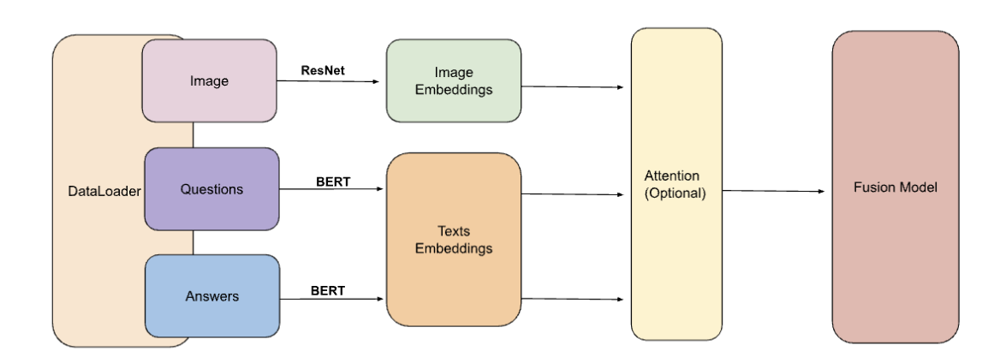
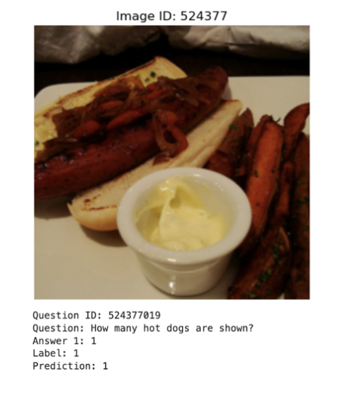

# Visual Question Answering (VQA) Project
This is the repository for the Chung-Yeh Yang and Jin Kyu Cho's final project of Fall 2024 DS340, Fusion Model for VQA verification. Run the download_data.ipynb, 
preprocess_data, and main.ipynb in order to use the code and see the outcome. 

## Overview
This project focuses on developing a model to classify answers to image-based questions as correct or incorrect. It integrates fusion and natural language processing techniques for the task of Visual Question Answering (VQA). Potential applications include assisting visually impaired individuals, improving automated customer service, and enhancing educational tools.

## Dataset
The dataset consists of image-question pairs with multiple answers. Correct answers are labeled based on agreement with human annotators, while incorrect answers are generated by sampling answers from unrelated questions. This approach ensures a balanced and diverse dataset for effective training.

## Model Architecture
The project implemented two model variants:
1. **Fusion Model Without Attention**: Combines image and text embeddings directly.
2. **Fusion Model With Attention**: Incorporates a multi-head attention mechanism to enhance feature integration.

Key components:
- **Image Features**: Extracted using a pre-trained ResNet50 model.
- **Text Features**: Processed using a pre-trained BERT model.
- **Classification Head**: Predicts correctness using fully connected layers.

## Training and Evaluation
- **Loss Function**: Binary Cross-Entropy Loss (BCELoss).
- **Optimizer**: AdamW with weight decay regularization.
- **Metrics**: Accuracy, Precision, Recall, and F1 Score.
- **Hardware**: Trained on NVIDIA GPUs with CUDA support.

Experiments were conducted with dataset sizes of 1,000, 10,000, and 100,000 data points. The model with attention trained on 10,000 data points achieved the best validation accuracy (87.07%).

## Results
### Sample Output:

  

The model predicts a binary label (0 or 1) to determine whether a given answer correctly matches the associated image and question. As shown in the figure, the question "How many hot dogs are shown?" is paired with the answer "1". The model accurately predicts the label as "1" (correct), demonstrating its ability to learn relationships between images, questions, and answers.

### Training and Validation Accuracy
| Dataset Size   | Without Attention | With Attention |
|----------------|-------------------|----------------|
| 1,000 Data Pts | 54.02% / 55.50%  | 54.86% / 57.08% |
| 10,000 Data Pts| 80.02% / 83.49%  | **86.12% / 87.07%** |
| 100,000 Data Pts| 89.07% / 84.71% | 85.99% / 86.52% |

The attention mechanism demonstrated significant improvements in generalization and performance for moderately sized datasets.

## Conclusion
This project highlights the importance of attention mechanisms in VQA tasks, offering a robust solution for integrating multimodal data. Future work includes scaling the dataset and exploring more complex architectures.

## References
1. OpenAI. ChatGPT. Version 4, 2024. [OpenAI](https://openai.com/chatgpt)
2. Sahu, Tezan. "Visual Question Answering with Multimodal Transformers." [Medium](https://medium.com/data-science-at-microsoft/visual-question-answering-with-multimodal-transformers-d4f57950c867)

---

*Placeholder for images and further documentation.*
